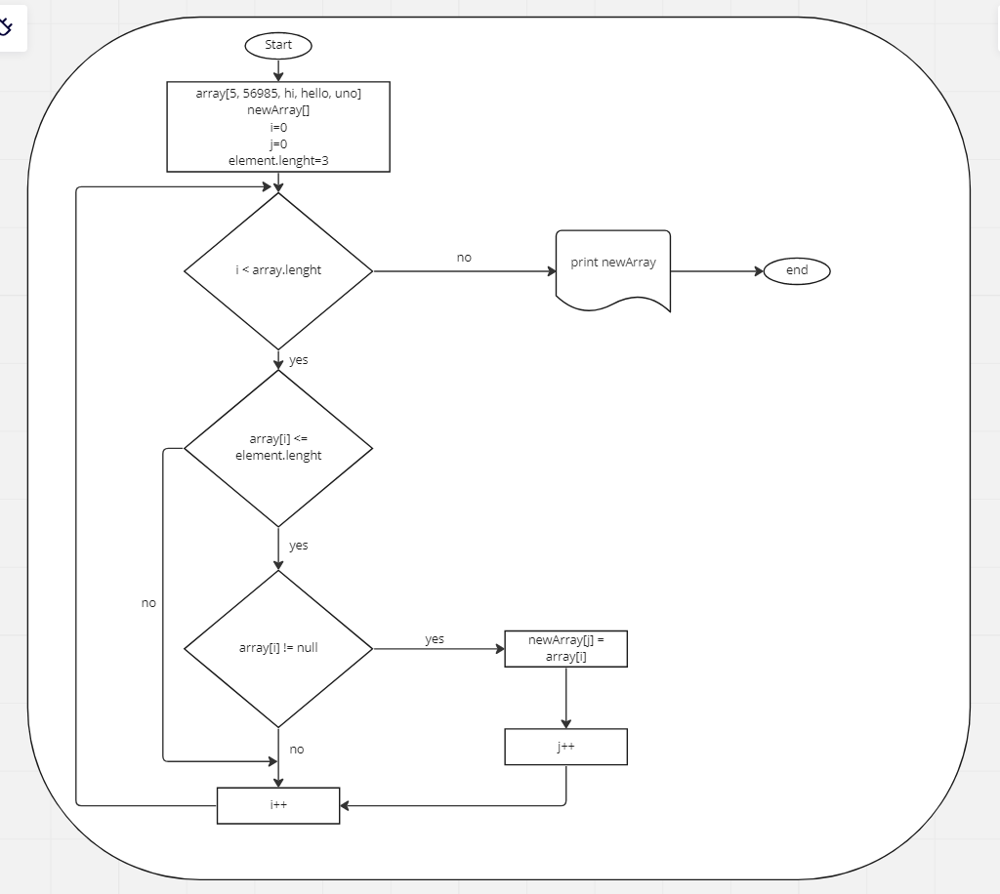

**Решение задачи**

1. Создали репозиторий в Git

2. Написали метод создания массива

3. Написали метод вывода массива

4. Написали метод, который обрабатывает массив 
введенный ранее и создает новый с требованиями описанными в задаче.

5. Закоммитили все по пунктам.

___________________________
**Ниже представлена блок-схема.**

